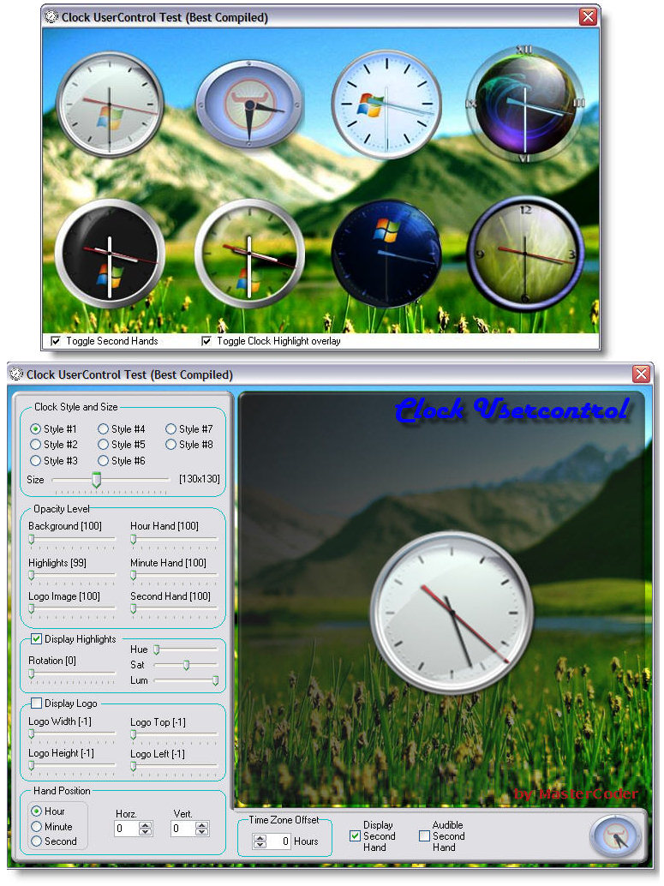



## ucClock \- Photorealistic Clock Control Update:March 28

### Description

A usercontrol that allows the user to use 1 of the 8 supplied clock images or supply there own. The user has full control over all aspects of the graphics; Background, Hour/Minute/Second hands, Logo and highlighting overlay.

You can set the transparency level of each graphic element, position the logo anywhere on the clock background.

All images are provided in .PNG format for full transparency.

Special thanks go to LaVolpe for his 32bbpDIB class, without which this project would not have been possible. *** Note: For optimal performance you should have GDI+ (GDI Plus) installed. If you do not, then I recommend downloading it for FREE from Microsoft, it is available for systems with Windows 98 and later. Link: http://www.microsoft.com/downloads/details.aspx?FamilyID=6a63ab9c-df12-4d41-933c-be590feaa05a&amp;DisplayLang=en

[Update: Monday March 19, 2007]

Added the ability to make the clock to any size, reguardless of the size of the source image.

Added the ability to rotate the Highlight image from 0-359 degrees, you can also now adjust the Hue, Saturation and Luminosity of the highlights.

Added the ability to play a TICK sound for each tick of the second hand.

[Update: Monday March 21, 2007]

IMPROVED clock refresh rate.

ADDED the ability to adjust each hand Horz. and Vert. position.

ADDED TimeZoneOffset, adjust clock for any timezone.

[Update: Monday March 24, 2007]

ADDED ability to set unlimited alarms, each alarm triggers an event.

ADDED full suite of events, Mouse-Click, Mouse-Double-Click, Mouse-Down, Mouse-Up, etc...

[Update: Monday March 27, 2007]

FIXED a bug when updating hand positions.
 
### More Info
 

             |
---                |---
**Submitted On**   |2007-03-24 22:37:34
**By**             |[Master\_Coder](https://github.com/Planet-Source-Code/PSCIndex/blob/master/ByAuthor/master-coder.md)
**Level**          |Intermediate
**User Rating**    |4.9 (240 globes from 49 users)
**Compatibility**  |VB 5\.0, VB 6\.0
**Category**       |[Graphics](https://github.com/Planet-Source-Code/PSCIndex/blob/master/ByCategory/graphics__1-46.md)
**World**          |[Visual Basic](https://github.com/Planet-Source-Code/PSCIndex/blob/master/ByWorld/visual-basic.md)
**Archive File**   |[ucClock\_\-\_2055933242007\.zip](https://github.com/Planet-Source-Code/master-coder-ucclock-photorealistic-clock-control-update-march-28__1-68149/archive/master.zip)

